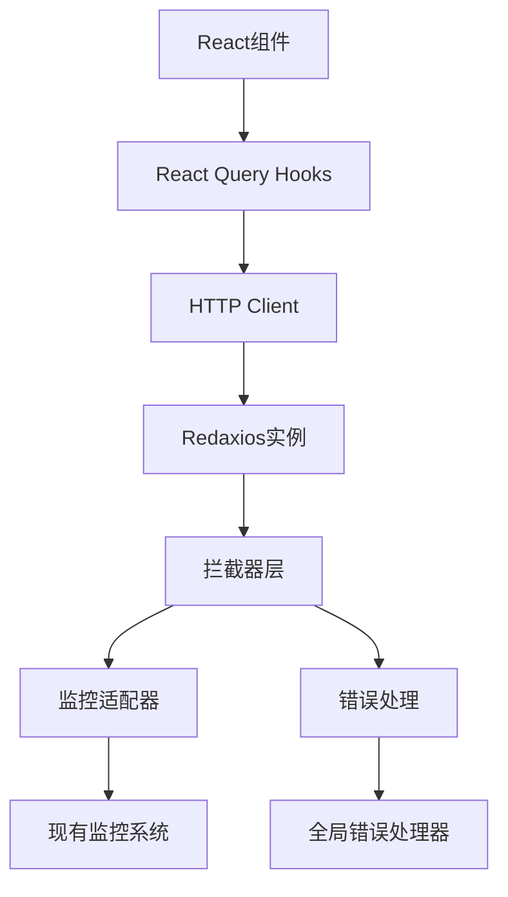

# Redaxios集成完整指南

本指南详细说明了如何在现有的TanStack Router + React Query项目中集成Redaxios HTTP客户端。

## 📋 目录

- [项目概述](#项目概述)
- [集成架构](#集成架构)
- [文件结构](#文件结构)
- [核心功能](#核心功能)
- [使用示例](#使用示例)
- [迁移指南](#迁移指南)
- [最佳实践](#最佳实践)
- [故障排除](#故障排除)

## 🎯 项目概述

### 集成目标
- 使用轻量级的Redaxios替代原生fetch
- 保持现有监控和错误处理系统
- 与React Query无缝集成
- 提供类型安全的API调用

### 技术栈
- **Redaxios**: 2.4KB的轻量级HTTP客户端
- **TanStack React Query**: 数据获取和缓存
- **TypeScript**: 完整类型安全
- **现有监控系统**: Sentry + 自定义监控

## 🏗️ 集成架构



## 📁 文件结构

```
src/lib/
├── http/                    # HTTP客户端核心
│   ├── client.ts           # Redaxios客户端封装
│   ├── config.ts           # HTTP配置
│   ├── types.ts            # 类型定义
│   ├── interceptors.ts     # 拦截器适配层
│   └── monitoring.ts       # 监控适配器
└── api/                    # API层
    ├── base.ts             # API基础配置
    └── hooks/              # React Query hooks
        ├── useUsers.ts     # 用户相关hooks
        ├── useAuth.ts      # 认证相关hooks
        └── index.ts        # 统一导出
```

## ⚡ 核心功能

### 1. HTTP客户端 ([`src/lib/http/client.ts`](src/lib/http/client.ts))

```typescript
import { http } from '@/lib/api/hooks'

// 基础用法
const users = await http.get<User[]>('/users')
const user = await http.post<User>('/users', userData)

// 高级功能
await http.upload('/upload', file)
await http.download('/files/report.pdf', 'report.pdf')
```

### 2. 监控集成 ([`src/lib/http/monitoring.ts`](src/lib/http/monitoring.ts))

- ✅ 自动记录慢请求（>5秒）
- ✅ HTTP错误状态码监控
- ✅ 网络错误追踪
- ✅ Sentry自动上报
- ✅ 性能指标收集

### 3. 拦截器系统 ([`src/lib/http/interceptors.ts`](src/lib/http/interceptors.ts))

- ✅ 自动添加认证token
- ✅ 请求ID生成
- ✅ 用户会话追踪
- ✅ 自动重试机制
- ✅ 401/403错误处理

### 4. React Query集成 ([`src/lib/api/hooks/`](src/lib/api/hooks/))

```typescript
// 用户管理
const { data: users, isLoading } = useUsers({ page: 1, limit: 20 })
const createUser = useCreateUser()
const updateUser = useUpdateUser()

// 认证
const { data: profile } = useProfile()
const login = useLogin()
const logout = useLogout()
```

## 🚀 使用示例

### 基础API调用

```typescript
import { http } from '@/lib/api/hooks'

// GET请求
const getUsers = async () => {
  const users = await http.get<User[]>('/users')
  return users
}

// POST请求
const createUser = async (userData: CreateUserData) => {
  const user = await http.post<User>('/users', userData)
  return user
}
```

### React Query Hooks

```typescript
import { useUsers, useCreateUser } from '@/lib/api/hooks'

function UserList() {
  const { data: users, isLoading, error } = useUsers({
    page: 1,
    limit: 20,
    search: 'john'
  })
  
  const createUser = useCreateUser()
  
  const handleCreate = async (userData: CreateUserData) => {
    try {
      await createUser.mutateAsync(userData)
      // 自动刷新用户列表
    } catch (error) {
      console.error('创建用户失败:', error)
    }
  }
  
  if (isLoading) return <div>加载中...</div>
  if (error) return <div>错误: {error.message}</div>
  
  return (
    <div>
      {users?.data.map(user => (
        <div key={user.id}>{user.name}</div>
      ))}
    </div>
  )
}
```

### 认证流程

```typescript
import { useLogin, useProfile, useLogout } from '@/lib/api/hooks'

function AuthExample() {
  const login = useLogin()
  const logout = useLogout()
  const { data: profile } = useProfile()
  
  const handleLogin = async (credentials: LoginCredentials) => {
    try {
      await login.mutateAsync(credentials)
      // 自动重定向或更新UI
    } catch (error) {
      console.error('登录失败:', error)
    }
  }
  
  return (
    <div>
      {profile ? (
        <div>
          <p>欢迎, {profile.name}!</p>
          <button onClick={() => logout.mutate()}>登出</button>
        </div>
      ) : (
        <LoginForm onSubmit={handleLogin} />
      )}
    </div>
  )
}
```

## 🔄 迁移指南

### 第一步：安装依赖

```bash
npm install redaxios
# 或
pnpm add redaxios
```

### 第二步：集成检查

确认以下文件已创建：
- ✅ [`src/lib/http/client.ts`](src/lib/http/client.ts)
- ✅ [`src/lib/http/config.ts`](src/lib/http/config.ts)
- ✅ [`src/lib/http/types.ts`](src/lib/http/types.ts)
- ✅ [`src/lib/http/interceptors.ts`](src/lib/http/interceptors.ts)
- ✅ [`src/lib/http/monitoring.ts`](src/lib/http/monitoring.ts)
- ✅ [`src/lib/api/base.ts`](src/lib/api/base.ts)
- ✅ [`src/lib/api/hooks/useUsers.ts`](src/lib/api/hooks/useUsers.ts)
- ✅ [`src/lib/api/hooks/useAuth.ts`](src/lib/api/hooks/useAuth.ts)
- ✅ [`src/lib/api/hooks/index.ts`](src/lib/api/hooks/index.ts)

### 第三步：环境变量配置

在 `.env` 文件中添加：

```env
VITE_API_BASE_URL=http://localhost:3001/api
VITE_MONITORING_API_ENDPOINT=http://localhost:3001/monitoring
VITE_SENTRY_DSN=your_sentry_dsn_here
```

### 第四步：验证集成

```typescript
// 在组件中测试
import { http } from '@/lib/api/hooks'

const testIntegration = async () => {
  try {
    // 测试基础请求
    const response = await http.get('/health')
    console.log('Redaxios集成成功:', response)
  } catch (error) {
    console.error('集成测试失败:', error)
  }
}
```

### 第五步：逐步替换

1. **新功能优先**: 新开发的功能直接使用Redaxios
2. **逐步迁移**: 将现有的fetch调用替换为Redaxios
3. **测试验证**: 确保监控和错误处理正常工作

## 📚 最佳实践

### 1. 错误处理

```typescript
// 使用React Query的错误处理
const { data, error, isError } = useUsers()

if (isError) {
  // 错误已经被全局错误处理器处理
  // 这里只需要显示用户友好的错误信息
  return <ErrorMessage error={error} />
}
```

### 2. 加载状态

```typescript
const { data, isLoading, isFetching } = useUsers()

return (
  <div>
    {isLoading && <Spinner />}
    {isFetching && <RefreshIndicator />}
    {data && <UserList users={data.data} />}
  </div>
)
```

### 3. 缓存策略

```typescript
// 长期缓存静态数据
const { data } = useQuery({
  queryKey: ['config'],
  queryFn: () => http.get('/config'),
  staleTime: 30 * 60 * 1000, // 30分钟
  gcTime: 60 * 60 * 1000,    // 1小时
})

// 短期缓存动态数据
const { data } = useUsers({
  staleTime: 5 * 60 * 1000,  // 5分钟
  gcTime: 10 * 60 * 1000,    // 10分钟
})
```

### 4. 类型安全

```typescript
// 定义明确的API响应类型
interface ApiResponse<T> {
  data: T
  message?: string
  status: 'success' | 'error'
}

// 使用泛型确保类型安全
const users = await http.get<ApiResponse<User[]>>('/users')
```

## 🔧 故障排除

### 常见问题

#### 1. TypeScript类型错误

**问题**: `Property 'xxx' does not exist on type 'AxiosRequestConfig'`

**解决**: 确保导入了正确的类型定义：

```typescript
import type { AxiosRequestConfig } from 'redaxios'
```

#### 2. 监控不工作

**问题**: 请求没有被监控系统捕获

**解决**: 检查全局标志是否设置：

```typescript
// 确保在client.ts中设置了
window.__USE_REDAXIOS__ = true
```

#### 3. 认证token不生效

**问题**: 请求没有自动添加Authorization header

**解决**: 检查token是否正确保存：

```typescript
// 登录成功后
localStorage.setItem('authToken', token)
```

#### 4. React Query缓存问题

**问题**: 数据没有正确缓存或更新

**解决**: 检查queryKey是否正确：

```typescript
// 确保queryKey唯一且一致
const queryKey = ['users', { page, limit, search }]
```

### 调试技巧

#### 1. 启用详细日志

```typescript
// 在开发环境中启用详细日志
if (import.meta.env.DEV) {
  console.log('HTTP Request:', config)
  console.log('HTTP Response:', response)
}
```

#### 2. 监控面板

访问 `/monitoring` 路由查看监控数据和错误统计。

#### 3. React Query DevTools

确保在开发环境中启用了React Query DevTools：

```typescript
import { ReactQueryDevtools } from '@tanstack/react-query-devtools'

// 在根组件中
<ReactQueryDevtools initialIsOpen={false} />
```

## 🎉 总结

Redaxios集成已完成！现在你可以：

- ✅ 使用轻量级的HTTP客户端（仅2.4KB）
- ✅ 保持完整的监控和错误处理
- ✅ 享受类型安全的API调用
- ✅ 利用React Query的强大缓存功能
- ✅ 获得更好的开发体验

如有问题，请参考本指南或查看相关源码文件。