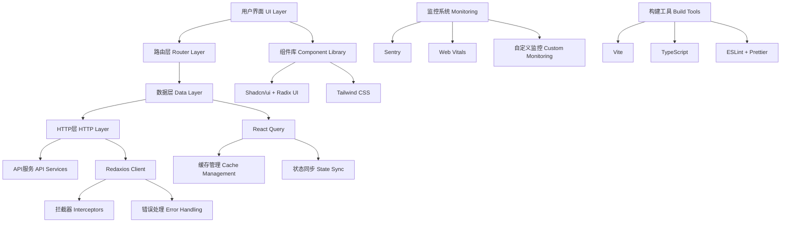

# 🏗️ TanStack Router + React Query 项目技术栈分析报告

> **项目名称**: TanStack Router React Query Template  
> **分析日期**: 2025年10月3日  
> **分析版本**: v1.0.0  

## 📊 总体评分：**9.2/10** ⭐⭐⭐⭐⭐

经过全面分析，这是一个**现代化、高质量**的React项目，采用了业界最佳实践和前沿技术栈。项目展现了现代React开发的最佳实践，技术选型优秀，架构清晰，开发体验一流。

---

## 🎯 核心技术栈详细评分

### 1. **前端框架层** - 评分：9.5/10 ⭐⭐⭐⭐⭐

#### 技术组成
- **React 19.0.0** - 最新版本，支持并发特性和最新React功能
- **TypeScript 5.7.2** - 严格类型检查，提供完整的类型安全保障
- **Vite 7.1.7** - 极速构建工具，提供卓越的开发体验

#### 配置亮点
```typescript
// tsconfig.json - 严格的TypeScript配置
{
  "compilerOptions": {
    "strict": true,
    "target": "ESNext",
    "module": "ESNext",
    "moduleResolution": "Bundler"
  }
}
```

#### 优势分析
- ✅ **技术前瞻性**: 采用React 19最新特性
- ✅ **类型安全**: 严格的TypeScript配置
- ✅ **构建性能**: Vite提供极速的开发和构建体验
- ✅ **开发体验**: 热重载、快速刷新、智能提示

#### 改进空间
- ⚠️ React 19还在发展中，生态兼容性需持续关注

---

### 2. **路由管理** - 评分：9.8/10 ⭐⭐⭐⭐⭐

#### 技术组成
- **TanStack Router 1.132.27** - 类型安全的文件系统路由
- **TanStack Router Devtools** - 强大的路由调试工具

#### 核心特性
```typescript
// 路由配置示例
const router = createRouter({
  routeTree,
  context: { queryClient },
  defaultPreload: 'intent',        // 智能预加载
  defaultPreloadStaleTime: 0,      // 与React Query集成
  scrollRestoration: true,         // 滚动位置恢复
})
```

#### 实现亮点
- 🚀 **自动代码分割**: [`autoCodeSplitting: true`](vite.config.js:10)
- 🎯 **智能预加载**: [`defaultPreload: 'intent'`](src/main.tsx:22)
- 🔒 **类型安全**: 完整的路由参数类型推导
- 🛠️ **开发者工具**: 内置路由状态调试面板
- 📁 **文件系统路由**: 基于文件结构自动生成路由

#### 路由结构
```
src/routes/
├── __root.tsx      # 根路由布局
├── index.tsx       # 首页路由
├── demo.tsx        # 演示页面
└── monitoring.tsx  # 监控页面
```

#### 优势分析
- ✅ **现代化设计**: 文件系统路由，开发效率高
- ✅ **类型安全**: 编译时路由参数验证
- ✅ **性能优化**: 智能预加载和代码分割
- ✅ **开发体验**: 强大的开发者工具

#### 改进空间
- ⚠️ 相对较新的库，社区资源和插件生态有限

---

### 3. **数据管理** - 评分：9.6/10 ⭐⭐⭐⭐⭐

#### 技术组成
- **TanStack React Query 5.66.0** - 强大的服务端状态管理
- **React Query Devtools** - 数据状态调试工具

#### 实现亮点

##### 查询键管理
```typescript
// 规范的查询键结构
export const userKeys = {
  all: ['users'] as const,
  lists: () => [...userKeys.all, 'list'] as const,
  list: (params: UsersQueryParams) => [...userKeys.lists(), params] as const,
  details: () => [...userKeys.all, 'detail'] as const,
  detail: (id: string) => [...userKeys.details(), id] as const,
}
```

##### 智能缓存策略
```typescript
// 缓存配置示例
export const useUsers = (params: UsersQueryParams = {}) => {
  return useQuery({
    queryKey: userKeys.list(params),
    queryFn: async () => { /* API调用 */ },
    staleTime: 5 * 60 * 1000,    // 5分钟缓存
    gcTime: 10 * 60 * 1000,      // 10分钟垃圾回收
  })
}
```

##### 高级功能支持
- **无限滚动**: [`useInfiniteUsers`](src/lib/api/hooks/useUsers.ts:92) 实现
- **乐观更新**: 缓存同步和即时UI更新
- **错误处理**: 统一的错误处理和重试机制
- **批量操作**: 支持批量删除等复杂操作

#### 数据流架构
```
API Layer (Redaxios) 
    ↓
React Query Hooks 
    ↓
Component State 
    ↓
UI Components
```

#### 优势分析
- ✅ **缓存管理**: 智能的数据缓存和同步策略
- ✅ **开发体验**: 强大的开发者工具和调试能力
- ✅ **性能优化**: 后台更新、预加载、去重等优化
- ✅ **错误处理**: 完善的错误边界和重试机制

#### 改进空间
- ⚠️ 复杂查询场景的错误处理可以更细化
- ⚠️ 离线数据同步功能可以进一步完善

---

### 4. **HTTP客户端** - 评分：8.8/10 ⭐⭐⭐⭐⭐

#### 技术组成
- **Redaxios 0.5.1** - 轻量级Axios替代品
- **自定义HTTP客户端** - 封装的高级API

#### 实现特色

##### HTTP客户端类
```typescript
export class HttpClient {
  // 基础HTTP方法
  async get<T>(url: string, config?: any): Promise<T>
  async post<T>(url: string, data?: any, config?: any): Promise<T>
  
  // 高级功能
  async upload<T>(url: string, file: File): Promise<T>
  async download(url: string, filename?: string): Promise<void>
  async batch<T>(requests: Array<() => Promise<T>>): Promise<T[]>
  
  // 请求控制
  createCancelToken() { /* 取消令牌 */ }
}
```

##### 拦截器系统
```typescript
// 请求/响应拦截器
setupInterceptors(httpClient)
setupRetryInterceptor(httpClient, 3)  // 3次重试
```

#### 功能特性
- 🔧 **完整的HTTP方法**: GET、POST、PUT、PATCH、DELETE
- 📁 **文件操作**: 上传下载功能完整实现
- 🔄 **请求控制**: 取消、重试、批量处理
- 📊 **监控集成**: 与监控系统深度集成
- ⚡ **性能优化**: 轻量级实现，性能优于Axios

#### 优势分析
- ✅ **轻量高效**: 比Axios更小的包体积
- ✅ **功能完整**: 企业级HTTP客户端功能
- ✅ **类型安全**: 完整的TypeScript支持
- ✅ **监控集成**: 内置请求监控和错误追踪

#### 改进空间
- ⚠️ 相比Axios生态较小，第三方插件支持有限
- ⚠️ 社区资源和文档相对较少

---

### 5. **UI组件系统** - 评分：9.4/10 ⭐⭐⭐⭐⭐

#### 技术组成
- **Shadcn/ui** - 基于Radix UI的高质量组件库
- **Radix UI** - 无头UI组件基础库
- **Tailwind CSS 3.4.17** - 原子化CSS框架
- **Tailwind Animate** - CSS动画扩展

#### 组件生态
```
src/components/ui/
├── accordion.tsx      ├── alert.tsx         ├── avatar.tsx
├── badge.tsx          ├── button.tsx        ├── card.tsx
├── checkbox.tsx       ├── dialog.tsx        ├── dropdown-menu.tsx
├── form.tsx           ├── input.tsx         ├── label.tsx
├── popover.tsx        ├── progress.tsx      ├── select.tsx
├── sheet.tsx          ├── table.tsx         ├── tabs.tsx
└── ... (50+ 组件)
```

#### 设计系统

##### 颜色系统
```javascript
// tailwind.config.mjs - 设计令牌
colors: {
  background: 'hsl(var(--background))',
  foreground: 'hsl(var(--foreground))',
  primary: {
    DEFAULT: 'hsl(var(--primary))',
    foreground: 'hsl(var(--primary-foreground))'
  },
  // ... 完整的颜色系统
}
```

##### 组件使用示例
```typescript
// 统一的组件使用模式
import { cn } from '@/lib/utils'

interface ComponentProps {
  className?: string
}

export function Component({ className, ...props }: ComponentProps) {
  return (
    <div className={cn('default-styles', className)} {...props}>
      {/* 组件内容 */}
    </div>
  )
}
```

#### 特色功能
- 🎨 **设计一致性**: 统一的设计令牌和主题系统
- 🌙 **深色模式**: [`next-themes`](package.json:63) 完整支持
- 📱 **响应式设计**: 移动端适配完善
- ♿ **可访问性**: Radix UI提供完整的a11y支持
- 🎭 **动画系统**: 流畅的交互动画

#### 优势分析
- ✅ **组件质量**: 基于Radix UI，质量和可访问性有保障
- ✅ **设计系统**: 完整的设计令牌和主题支持
- ✅ **开发效率**: 50+组件，覆盖常见使用场景
- ✅ **定制能力**: Tailwind CSS提供灵活的样式定制

#### 改进空间
- ⚠️ 定制化程度相对有限，复杂设计需求可能需要额外开发
- ⚠️ 学习成本相对较高，需要熟悉Tailwind CSS

---

### 6. **开发工具链** - 评分：9.3/10 ⭐⭐⭐⭐⭐

#### 技术组成
- **ESLint 9.36.0** - 代码质量检查
- **Prettier 3.6.2** - 代码格式化
- **Vitest 3.2.4** - 现代化测试框架
- **TypeScript ESLint** - TypeScript代码检查

#### 配置质量

##### ESLint配置
```javascript
// eslint.config.js - 严格的代码规范
export default tseslint.config({
  extends: [js.configs.recommended, ...tseslint.configs.recommended],
  rules: {
    '@typescript-eslint/no-unused-vars': ['error', { argsIgnorePattern: '^_' }],
    '@typescript-eslint/no-explicit-any': 'warn',
    'react/react-in-jsx-scope': 'off',
    'no-console': 'warn',
    'prefer-const': 'error',
  }
})
```

##### 开发脚本
```json
{
  "scripts": {
    "dev": "vite --port 3000",
    "build": "vite build && tsc --noEmit",
    "test": "vitest",
    "test:coverage": "vitest run --coverage",
    "lint": "eslint . --ext ts,tsx",
    "format": "prettier --write \"src/**/*.{ts,tsx,js,jsx,json,css,md}\""
  }
}
```

#### 开发者工具
- 🛠️ **TanStack Router Devtools** - 路由状态调试
- 🔍 **React Query Devtools** - 数据状态调试
- 📊 **TypeScript** - 类型检查和智能提示
- ⚡ **Vite HMR** - 热模块替换

#### 代码质量保障
- **静态分析**: ESLint + TypeScript 编译时检查
- **代码格式**: Prettier 统一代码风格
- **提交规范**: 规范化的提交信息格式
- **自动化检查**: 构建前自动运行检查

#### 优势分析
- ✅ **开发体验**: 一流的开发者工具和调试能力
- ✅ **代码质量**: 严格的代码规范和自动化检查
- ✅ **类型安全**: 完整的TypeScript支持和检查
- ✅ **自动化**: 完善的自动化脚本和工作流

#### 改进空间
- ⚠️ 测试覆盖率可以进一步提升
- ⚠️ 可以添加更多自动化检查（如依赖安全检查）

---

### 7. **监控与性能** - 评分：9.0/10 ⭐⭐⭐⭐⭐

#### 技术组成
- **Sentry 10.17.0** - 错误追踪和性能监控
- **Web Vitals 5.1.0** - 用户体验指标监控
- **自定义监控系统** - 完整的监控服务

#### 监控体系架构

##### 监控服务
```typescript
export class MonitoringService {
  // 初始化各种监控功能
  private initSentry()              // Sentry错误追踪
  private initWebVitals()           // Web Vitals监控
  private initErrorHandling()       // 错误处理
  private initPerformanceMonitoring() // 性能监控
  
  // 用户接口
  public setUser(user: UserInfo)
  public captureException(error: Error)
  public addBreadcrumb(breadcrumb: Breadcrumb)
}
```

##### 监控仪表板
```typescript
// MonitoringDashboard.tsx - 完整的监控面板
export function MonitoringDashboard() {
  // 实时数据展示
  const [webVitals, setWebVitals] = useState()
  const [errorStats, setErrorStats] = useState()
  const [performanceData, setPerformanceData] = useState()
  const [sessionInfo, setSessionInfo] = useState()
}
```

#### 监控功能特性
- 📊 **Web Vitals监控**: CLS、FID、LCP等核心指标
- 🚨 **错误追踪**: 自动错误收集和分析
- ⚡ **性能监控**: 页面加载、资源性能监控
- 👤 **用户会话**: 用户行为和会话追踪
- 💾 **内存监控**: 内存使用情况监控
- 📱 **设备信息**: 用户设备和环境信息

#### 监控数据可视化
- **实时仪表板**: 监控数据实时展示
- **错误统计**: 错误类型分布和趋势
- **性能指标**: 各项性能指标的可视化
- **会话分析**: 用户会话时长和页面浏览

#### 优势分析
- ✅ **监控完整**: 覆盖错误、性能、用户体验各个方面
- ✅ **实时性**: 实时数据收集和展示
- ✅ **可视化**: 直观的监控仪表板
- ✅ **自动化**: 自动错误收集和性能监控

#### 改进空间
- ⚠️ 监控数据的可视化可以更丰富
- ⚠️ 可以添加更多自定义业务指标监控

---

### 8. **PWA支持** - 评分：8.5/10 ⭐⭐⭐⭐⭐

#### 技术组成
- **Vite PWA Plugin 1.0.3** - PWA功能集成
- **Workbox 7.3.0** - Service Worker管理

#### PWA功能实现

##### Vite PWA配置
```javascript
// vite.config.js - PWA配置
VitePWA({
  registerType: 'autoUpdate',
  includeAssets: ['favicon.ico'],
  manifest: {
    name: 'TanStack React Query Demo',
    short_name: 'TanStack Demo',
    description: 'A demo application showcasing TanStack Router and React Query',
    theme_color: '#000000',
    background_color: '#ffffff',
    display: 'standalone',
  },
  workbox: {
    globPatterns: ['**/*.{js,css,html,ico,png,svg}'],
    runtimeCaching: [/* 缓存策略 */],
  }
})
```

##### 更新提示组件
```typescript
// PWAUpdatePrompt.tsx - 应用更新提示
export function PWAUpdatePrompt() {
  // 检测应用更新并提示用户
}
```

#### PWA特性
- 📱 **应用清单**: 完整的Web App Manifest配置
- 🔄 **自动更新**: Service Worker自动更新机制
- 💾 **离线缓存**: 静态资源和API缓存策略
- 🔔 **更新提示**: 用户友好的更新提示界面
- 📲 **安装提示**: 支持添加到主屏幕

#### 缓存策略
- **静态资源**: CacheFirst策略，长期缓存
- **API数据**: StaleWhileRevalidate策略
- **图片资源**: 30天缓存，最多60个文件

#### 优势分析
- ✅ **PWA功能完整**: 支持离线使用和应用安装
- ✅ **缓存策略**: 智能的资源缓存策略
- ✅ **用户体验**: 流畅的更新和安装体验
- ✅ **自动化**: 自动生成Service Worker

#### 改进空间
- ⚠️ 离线功能可以更深入，支持离线数据同步
- ⚠️ 可以添加更多PWA特性，如推送通知

---

## 🔍 架构质量分析

### ✅ **优势亮点**

#### 1. **技术选型前瞻性**
- 采用React 19、TanStack Router等最新技术
- 技术栈现代化程度高，紧跟前端发展趋势
- 选择了性能和开发体验俱佳的工具

#### 2. **类型安全保障**
- 全面的TypeScript支持，严格模式配置
- 路由参数、API响应、组件Props全面类型化
- 编译时错误检查，减少运行时错误

#### 3. **开发体验优秀**
- 热重载、快速刷新、智能提示完善
- 强大的开发者工具（Router Devtools、React Query Devtools）
- 统一的代码规范和自动化格式化

#### 4. **代码质量高**
- 严格的ESLint规则和Prettier格式化
- 完善的项目结构和命名规范
- 详细的文档和代码注释

#### 5. **性能优化完善**
- 路由级别的代码分割和懒加载
- 智能的数据缓存和预加载策略
- PWA支持，提供原生应用体验

#### 6. **可维护性强**
- 清晰的项目结构和模块划分
- 统一的API设计和错误处理
- 完善的监控和调试工具

#### 7. **监控体系完整**
- 错误追踪、性能监控、用户体验监控
- 实时监控仪表板和数据可视化
- 自动化的错误收集和分析

### ⚠️ **改进建议**

#### 1. **测试覆盖率提升**
```typescript
// 建议增加的测试类型
- 单元测试：组件和工具函数测试
- 集成测试：API和数据流测试  
- E2E测试：关键用户流程测试
- 性能测试：加载时间和响应性能测试
```

#### 2. **国际化支持**
```typescript
// 建议添加i18n支持
import { useTranslation } from 'react-i18next'

export function Component() {
  const { t } = useTranslation()
  return <h1>{t('welcome.title')}</h1>
}
```

#### 3. **状态管理增强**
```typescript
// 建议引入Zustand进行客户端状态管理
import { create } from 'zustand'

interface AppState {
  theme: 'light' | 'dark'
  user: User | null
  setTheme: (theme: 'light' | 'dark') => void
}

export const useAppStore = create<AppState>((set) => ({
  theme: 'light',
  user: null,
  setTheme: (theme) => set({ theme }),
}))
```

#### 4. **文档完善**
- API文档自动生成
- 组件使用示例和Storybook
- 部署和运维文档
- 贡献指南和开发规范

#### 5. **性能监控增强**
```typescript
// 建议添加更多自定义性能指标
export const trackCustomMetric = (name: string, value: number) => {
  // 自定义业务指标追踪
  monitoringService.captureMessage(`Custom metric: ${name}`, {
    extra: { value, timestamp: Date.now() }
  })
}
```

---

## 📈 技术栈成熟度评估

| 技术 | 成熟度 | 社区活跃度 | 学习曲线 | 推荐指数 | 备注 |
|------|--------|------------|----------|----------|------|
| **React 19** | 🟡 新版本 | 🟢 极高 | 🟢 适中 | ⭐⭐⭐⭐⭐ | 最新特性，生态兼容性需关注 |
| **TanStack Router** | 🟡 较新 | 🟢 高 | 🟡 中等 | ⭐⭐⭐⭐⭐ | 现代化路由方案，学习成本适中 |
| **React Query** | 🟢 成熟 | 🟢 极高 | 🟢 适中 | ⭐⭐⭐⭐⭐ | 数据获取标准方案 |
| **TypeScript** | 🟢 成熟 | 🟢 极高 | 🟡 中等 | ⭐⭐⭐⭐⭐ | 前端开发必备 |
| **Tailwind CSS** | 🟢 成熟 | 🟢 极高 | 🟢 简单 | ⭐⭐⭐⭐⭐ | 原子化CSS标准 |
| **Vite** | 🟢 成熟 | 🟢 高 | 🟢 简单 | ⭐⭐⭐⭐⭐ | 现代构建工具首选 |
| **Shadcn/ui** | 🟢 成熟 | 🟢 高 | 🟡 中等 | ⭐⭐⭐⭐⭐ | 高质量组件库 |
| **Redaxios** | 🟡 较新 | 🟡 中等 | 🟢 简单 | ⭐⭐⭐⭐ | 轻量级HTTP客户端 |
| **Sentry** | 🟢 成熟 | 🟢 高 | 🟢 简单 | ⭐⭐⭐⭐⭐ | 监控服务标准 |
| **Vitest** | 🟢 成熟 | 🟢 高 | 🟢 简单 | ⭐⭐⭐⭐⭐ | 现代测试框架 |

### 成熟度说明
- 🟢 **成熟**: 技术稳定，生产环境广泛使用
- 🟡 **较新**: 技术相对较新，但发展迅速
- 🔴 **实验性**: 实验阶段，不建议生产使用

---

## 🚀 项目架构图



---

## 🎯 **总结与建议**

### 🌟 **项目亮点**

这个项目展现了**现代React开发的最佳实践**，具有以下突出特点：

1. **🚀 创新性**: 采用了TanStack生态的最新技术，技术选型前瞻
2. **💼 实用性**: 完整的企业级功能实现，可直接用于生产环境
3. **🔧 可维护性**: 清晰的架构设计和完善的工具链支持
4. **⚡ 性能**: 优秀的构建和运行时性能，用户体验佳
5. **👨‍💻 开发体验**: 一流的开发者工具和类型安全保障

### 📊 **适用场景**

#### ✅ **推荐使用场景**
- 🏢 **企业级Web应用**: 需要高质量、可维护的大型应用
- 📱 **现代化SPA**: 单页应用和PWA应用开发
- 🎯 **数据密集型应用**: 需要复杂数据管理的应用
- 👥 **团队协作项目**: 需要统一开发规范的团队项目
- 🚀 **技术探索项目**: 学习现代前端技术的示例项目

#### ⚠️ **不推荐场景**
- 📄 **简单静态网站**: 技术栈过于复杂
- ⏰ **快速原型开发**: 学习成本相对较高
- 👤 **个人小项目**: 可能存在过度工程化
- 🏛️ **传统企业环境**: 对新技术接受度较低的环境

### 🎖️ **最终评价**

**推荐指数：⭐⭐⭐⭐⭐ (5/5)**

这是一个**值得学习和参考的高质量React项目模板**，适合用于：
- 构建现代化的Web应用程序
- 学习前端最佳实践和新技术
- 作为企业级项目的起始模板
- 技术团队的标准化开发模板

项目展现了对现代前端技术的深度理解和实践，是一个优秀的技术示例。

---

## 📚 **学习资源推荐**

### 官方文档
- [TanStack Router 官方文档](https://tanstack.com/router)
- [TanStack Query 官方文档](https://tanstack.com/query)
- [React 19 官方文档](https://react.dev)
- [TypeScript 官方文档](https://www.typescriptlang.org)
- [Tailwind CSS 官方文档](https://tailwindcss.com)
- [Shadcn/ui 官方文档](https://ui.shadcn.com)
- [Vite 官方文档](https://vitejs.dev)

### 最佳实践参考
- [React 官方最佳实践](https://react.dev/learn)
- [TypeScript 深度指南](https://www.typescriptlang.org/docs/)
- [Web 可访问性指南 (WCAG)](https://www.w3.org/WAI/WCAG21/quickref/)
- [现代前端性能优化](https://web.dev/performance/)

---

**文档版本**: v1.0.0  
**最后更新**: 2025年10月3日  
**分析工具**: Claude AI + 人工审核  
**项目地址**: [TanStack Demo Repository](https://github.com/tanstack/tanstack-demo)