# 🏗️ TanStack Router + React Query 项目技术栈分析报告

> **项目名称**: TanStack Router React Query Template  
> **分析日期**: 2025年10月3日  
> **分析版本**: v2.0.0 (重大更新)  

## 📊 总体评分：**9.6/10** ⭐⭐⭐⭐⭐

经过全面分析，这是一个**企业级、现代化**的React项目，采用了业界最佳实践和前沿技术栈。**项目经历了重大技术升级**，新增了国际化、状态管理、通知系统等核心功能，技术栈更加完善和成熟。

## 🆕 **重大技术更新亮点**

### 新增核心功能
- ✨ **国际化系统** - 完整的 i18next + react-i18next 多语言支持
- 🏪 **状态管理** - 企业级 Zustand 状态管理架构
- 🔔 **通知系统** - 全局通知和消息管理
- 🌐 **语言切换** - 智能语言检测和切换组件
- 📱 **响应式增强** - 移动端适配和主题系统优化

---

## 🎯 核心技术栈详细评分

### 1. **前端框架层** - 评分：9.5/10 ⭐⭐⭐⭐⭐

#### 技术组成
- **React 19.0.0** - 最新版本，支持并发特性和最新React功能
- **TypeScript 5.7.2** - 严格类型检查，提供完整的类型安全保障
- **Vite 7.1.7** - 极速构建工具，提供卓越的开发体验

#### 配置亮点
```typescript
// tsconfig.json - 严格的TypeScript配置
{
  "compilerOptions": {
    "strict": true,
    "target": "ESNext",
    "module": "ESNext",
    "moduleResolution": "Bundler"
  }
}
```

#### 优势分析
- ✅ **技术前瞻性**: 采用React 19最新特性
- ✅ **类型安全**: 严格的TypeScript配置
- ✅ **构建性能**: Vite提供极速的开发和构建体验
- ✅ **开发体验**: 热重载、快速刷新、智能提示

#### 改进空间
- ⚠️ React 19还在发展中，生态兼容性需持续关注

---

### 2. **路由管理** - 评分：9.8/10 ⭐⭐⭐⭐⭐

#### 技术组成
- **TanStack Router 1.132.27** - 类型安全的文件系统路由
- **TanStack Router Devtools** - 强大的路由调试工具

#### 核心特性
```typescript
// 路由配置示例
const router = createRouter({
  routeTree,
  context: { queryClient },
  defaultPreload: 'intent',        // 智能预加载
  defaultPreloadStaleTime: 0,      // 与React Query集成
  scrollRestoration: true,         // 滚动位置恢复
})
```

#### 实现亮点
- 🚀 **自动代码分割**: [`autoCodeSplitting: true`](vite.config.js:10)
- 🎯 **智能预加载**: [`defaultPreload: 'intent'`](src/main.tsx:22)
- 🔒 **类型安全**: 完整的路由参数类型推导
- 🛠️ **开发者工具**: 内置路由状态调试面板
- 📁 **文件系统路由**: 基于文件结构自动生成路由

#### 路由结构
```
src/routes/
├── __root.tsx      # 根路由布局
├── index.tsx       # 首页路由
├── demo.tsx        # 演示页面
└── monitoring.tsx  # 监控页面
```

#### 优势分析
- ✅ **现代化设计**: 文件系统路由，开发效率高
- ✅ **类型安全**: 编译时路由参数验证
- ✅ **性能优化**: 智能预加载和代码分割
- ✅ **开发体验**: 强大的开发者工具

#### 改进空间
- ⚠️ 相对较新的库，社区资源和插件生态有限

---

### 3. **数据管理** - 评分：9.6/10 ⭐⭐⭐⭐⭐

#### 技术组成
- **TanStack React Query 5.66.0** - 强大的服务端状态管理
- **React Query Devtools** - 数据状态调试工具

#### 实现亮点

##### 查询键管理
```typescript
// 规范的查询键结构
export const userKeys = {
  all: ['users'] as const,
  lists: () => [...userKeys.all, 'list'] as const,
  list: (params: UsersQueryParams) => [...userKeys.lists(), params] as const,
  details: () => [...userKeys.all, 'detail'] as const,
  detail: (id: string) => [...userKeys.details(), id] as const,
}
```

##### 智能缓存策略
```typescript
// 缓存配置示例
export const useUsers = (params: UsersQueryParams = {}) => {
  return useQuery({
    queryKey: userKeys.list(params),
    queryFn: async () => { /* API调用 */ },
    staleTime: 5 * 60 * 1000,    // 5分钟缓存
    gcTime: 10 * 60 * 1000,      // 10分钟垃圾回收
  })
}
```

##### 高级功能支持
- **无限滚动**: [`useInfiniteUsers`](src/lib/api/hooks/useUsers.ts:92) 实现
- **乐观更新**: 缓存同步和即时UI更新
- **错误处理**: 统一的错误处理和重试机制
- **批量操作**: 支持批量删除等复杂操作

#### 数据流架构
```
API Layer (Redaxios) 
    ↓
React Query Hooks 
    ↓
Component State 
    ↓
UI Components
```

#### 优势分析
- ✅ **缓存管理**: 智能的数据缓存和同步策略
- ✅ **开发体验**: 强大的开发者工具和调试能力
- ✅ **性能优化**: 后台更新、预加载、去重等优化
- ✅ **错误处理**: 完善的错误边界和重试机制

#### 改进空间
- ⚠️ 复杂查询场景的错误处理可以更细化
- ⚠️ 离线数据同步功能可以进一步完善

---

### 4. **HTTP客户端** - 评分：8.8/10 ⭐⭐⭐⭐⭐

#### 技术组成
- **Redaxios 0.5.1** - 轻量级Axios替代品
- **自定义HTTP客户端** - 封装的高级API

#### 实现特色

##### HTTP客户端类
```typescript
export class HttpClient {
  // 基础HTTP方法
  async get<T>(url: string, config?: any): Promise<T>
  async post<T>(url: string, data?: any, config?: any): Promise<T>
  
  // 高级功能
  async upload<T>(url: string, file: File): Promise<T>
  async download(url: string, filename?: string): Promise<void>
  async batch<T>(requests: Array<() => Promise<T>>): Promise<T[]>
  
  // 请求控制
  createCancelToken() { /* 取消令牌 */ }
}
```

##### 拦截器系统
```typescript
// 请求/响应拦截器
setupInterceptors(httpClient)
setupRetryInterceptor(httpClient, 3)  // 3次重试
```

#### 功能特性
- 🔧 **完整的HTTP方法**: GET、POST、PUT、PATCH、DELETE
- 📁 **文件操作**: 上传下载功能完整实现
- 🔄 **请求控制**: 取消、重试、批量处理
- 📊 **监控集成**: 与监控系统深度集成
- ⚡ **性能优化**: 轻量级实现，性能优于Axios

#### 优势分析
- ✅ **轻量高效**: 比Axios更小的包体积
- ✅ **功能完整**: 企业级HTTP客户端功能
- ✅ **类型安全**: 完整的TypeScript支持
- ✅ **监控集成**: 内置请求监控和错误追踪

#### 改进空间
- ⚠️ 相比Axios生态较小，第三方插件支持有限
- ⚠️ 社区资源和文档相对较少

---

### 5. **UI组件系统** - 评分：9.4/10 ⭐⭐⭐⭐⭐

#### 技术组成
- **Shadcn/ui** - 基于Radix UI的高质量组件库
- **Radix UI** - 无头UI组件基础库
- **Tailwind CSS 3.4.17** - 原子化CSS框架
- **Tailwind Animate** - CSS动画扩展

#### 组件生态
```
src/components/ui/
├── accordion.tsx      ├── alert.tsx         ├── avatar.tsx
├── badge.tsx          ├── button.tsx        ├── card.tsx
├── checkbox.tsx       ├── dialog.tsx        ├── dropdown-menu.tsx
├── form.tsx           ├── input.tsx         ├── label.tsx
├── popover.tsx        ├── progress.tsx      ├── select.tsx
├── sheet.tsx          ├── table.tsx         ├── tabs.tsx
└── ... (50+ 组件)
```

#### 设计系统

##### 颜色系统
```javascript
// tailwind.config.mjs - 设计令牌
colors: {
  background: 'hsl(var(--background))',
  foreground: 'hsl(var(--foreground))',
  primary: {
    DEFAULT: 'hsl(var(--primary))',
    foreground: 'hsl(var(--primary-foreground))'
  },
  // ... 完整的颜色系统
}
```

##### 组件使用示例
```typescript
// 统一的组件使用模式
import { cn } from '@/lib/utils'

interface ComponentProps {
  className?: string
}

export function Component({ className, ...props }: ComponentProps) {
  return (
    <div className={cn('default-styles', className)} {...props}>
      {/* 组件内容 */}
    </div>
  )
}
```

#### 特色功能
- 🎨 **设计一致性**: 统一的设计令牌和主题系统
- 🌙 **深色模式**: [`next-themes`](package.json:65) 完整支持
- 📱 **响应式设计**: 移动端适配完善
- ♿ **可访问性**: Radix UI提供完整的a11y支持
- 🎭 **动画系统**: 流畅的交互动画

#### 优势分析
- ✅ **组件质量**: 基于Radix UI，质量和可访问性有保障
- ✅ **设计系统**: 完整的设计令牌和主题支持
- ✅ **开发效率**: 50+组件，覆盖常见使用场景
- ✅ **定制能力**: Tailwind CSS提供灵活的样式定制

#### 改进空间
- ⚠️ 定制化程度相对有限，复杂设计需求可能需要额外开发
- ⚠️ 学习成本相对较高，需要熟悉Tailwind CSS

---

### 6. **开发工具链** - 评分：9.3/10 ⭐⭐⭐⭐⭐

#### 技术组成
- **ESLint 9.36.0** - 代码质量检查
- **Prettier 3.6.2** - 代码格式化
- **Vitest 3.2.4** - 现代化测试框架
- **TypeScript ESLint** - TypeScript代码检查

#### 配置质量

##### ESLint配置
```javascript
// eslint.config.js - 严格的代码规范
export default tseslint.config({
  extends: [js.configs.recommended, ...tseslint.configs.recommended],
  rules: {
    '@typescript-eslint/no-unused-vars': ['error', { argsIgnorePattern: '^_' }],
    '@typescript-eslint/no-explicit-any': 'warn',
    'react/react-in-jsx-scope': 'off',
    'no-console': 'warn',
    'prefer-const': 'error',
  }
})
```

##### 开发脚本
```json
{
  "scripts": {
    "dev": "vite --port 3000",
    "build": "vite build && tsc --noEmit",
    "test": "vitest",
    "test:coverage": "vitest run --coverage",
    "lint": "eslint . --ext ts,tsx",
    "format": "prettier --write \"src/**/*.{ts,tsx,js,jsx,json,css,md}\""
  }
}
```

#### 开发者工具
- 🛠️ **TanStack Router Devtools** - 路由状态调试
- 🔍 **React Query Devtools** - 数据状态调试
- 📊 **TypeScript** - 类型检查和智能提示
- ⚡ **Vite HMR** - 热模块替换

#### 代码质量保障
- **静态分析**: ESLint + TypeScript 编译时检查
- **代码格式**: Prettier 统一代码风格
- **提交规范**: 规范化的提交信息格式
- **自动化检查**: 构建前自动运行检查

#### 优势分析
- ✅ **开发体验**: 一流的开发者工具和调试能力
- ✅ **代码质量**: 严格的代码规范和自动化检查
- ✅ **类型安全**: 完整的TypeScript支持和检查
- ✅ **自动化**: 完善的自动化脚本和工作流

#### 改进空间
- ⚠️ 测试覆盖率可以进一步提升
- ⚠️ 可以添加更多自动化检查（如依赖安全检查）

---

### 7. **监控与性能** - 评分：9.0/10 ⭐⭐⭐⭐⭐

#### 技术组成
- **Sentry 10.17.0** - 错误追踪和性能监控
- **Web Vitals 5.1.0** - 用户体验指标监控
- **自定义监控系统** - 完整的监控服务

#### 监控体系架构

##### 监控服务
```typescript
export class MonitoringService {
  // 初始化各种监控功能
  private initSentry()              // Sentry错误追踪
  private initWebVitals()           // Web Vitals监控
  private initErrorHandling()       // 错误处理
  private initPerformanceMonitoring() // 性能监控
  
  // 用户接口
  public setUser(user: UserInfo)
  public captureException(error: Error)
  public addBreadcrumb(breadcrumb: Breadcrumb)
}
```

##### 监控仪表板
```typescript
// MonitoringDashboard.tsx - 完整的监控面板
export function MonitoringDashboard() {
  // 实时数据展示
  const [webVitals, setWebVitals] = useState()
  const [errorStats, setErrorStats] = useState()
  const [performanceData, setPerformanceData] = useState()
  const [sessionInfo, setSessionInfo] = useState()
}
```

#### 监控功能特性
- 📊 **Web Vitals监控**: CLS、FID、LCP等核心指标
- 🚨 **错误追踪**: 自动错误收集和分析
- ⚡ **性能监控**: 页面加载、资源性能监控
- 👤 **用户会话**: 用户行为和会话追踪
- 💾 **内存监控**: 内存使用情况监控
- 📱 **设备信息**: 用户设备和环境信息

#### 监控数据可视化
- **实时仪表板**: 监控数据实时展示
- **错误统计**: 错误类型分布和趋势
- **性能指标**: 各项性能指标的可视化
- **会话分析**: 用户会话时长和页面浏览

#### 优势分析
- ✅ **监控完整**: 覆盖错误、性能、用户体验各个方面
- ✅ **实时性**: 实时数据收集和展示
- ✅ **可视化**: 直观的监控仪表板
- ✅ **自动化**: 自动错误收集和性能监控

#### 改进空间
- ⚠️ 监控数据的可视化可以更丰富
- ⚠️ 可以添加更多自定义业务指标监控

---

### 8. **国际化系统** - 评分：9.7/10 ⭐⭐⭐⭐⭐

#### 技术组成
- **i18next 25.5.3** - 强大的国际化框架
- **react-i18next 16.0.0** - React 集成库
- **i18next-browser-languagedetector 8.2.0** - 自动语言检测

#### 实现亮点

##### 完整的国际化架构
```typescript
// i18n 配置 - 支持中英双语
const resources = {
  'zh-CN': { translation: zhCN },
  'en-US': { translation: enUS },
}

i18n
  .use(LanguageDetector)
  .use(initReactI18next)
  .init({
    resources,
    fallbackLng: 'zh-CN',
    detection: {
      order: ['localStorage', 'navigator', 'htmlTag'],
      caches: ['localStorage'],
    }
  })
```

##### 高级 Hooks 系统
```typescript
// 增强的国际化 Hook
export const useI18n = () => {
  const { t, i18n } = useTranslation()
  const { currentLanguage, changeLanguage } = useLanguageSwitcher()
  
  return {
    t, changeLanguage, currentLanguage,
    formatDate, formatNumber, formatCurrency,
    isZhCN: currentLanguage.code === 'zh-CN'
  }
}
```

##### 语言切换组件
- **LanguageSwitcher**: 下拉菜单式切换器
- **SimpleLanguageSwitcher**: 循环切换按钮  
- **InlineLanguageSwitcher**: 内联式切换器

#### 功能特性
- 🌍 **双语支持**: 中文简体 + 英文
- 🔍 **智能检测**: 自动检测用户语言偏好
- 💾 **状态持久化**: localStorage 保存语言选择
- 🎨 **本地化格式**: 日期、数字、货币格式化
- 🔄 **实时切换**: 无刷新语言切换
- 📱 **响应式**: 移动端适配的语言切换界面

#### 优势分析
- ✅ **完整性**: 覆盖UI文本、错误信息、系统消息
- ✅ **易扩展**: 支持轻松添加新语言
- ✅ **类型安全**: 完整的 TypeScript 支持
- ✅ **性能优化**: 懒加载和缓存机制
- ✅ **用户体验**: 智能检测和记忆用户偏好

#### 改进空间
- ⚠️ 可考虑添加更多语言支持
- ⚠️ 可实现翻译文件的动态加载

---

### 9. **状态管理系统** - 评分：9.8/10 ⭐⭐⭐⭐⭐

#### 技术组成
- **Zustand 5.0.8** - 轻量级状态管理库
- **企业级架构** - 模块化 Store 设计
- **中间件支持** - 持久化、开发工具、订阅选择器

#### 架构设计

##### Store 分层架构
```typescript
// 三层 Store 架构
src/stores/
├── uiStore.ts      # UI状态管理 (主题、侧边栏、通知)
├── appStore.ts     # 应用状态管理 (初始化、网络、功能开关)
├── authStore.ts    # 认证状态管理 (权限、会话、登录状态)
├── types.ts        # 完整类型定义
├── config.ts       # 配置和工具函数
└── index.ts        # 统一导出
```

##### UI Store 功能
```typescript
export const useUIStore = create<UIStore>()(
  createStoreWithMiddleware({
    // 主题管理
    theme: 'system',
    setTheme: (theme) => { /* 智能主题切换 */ },
    
    // 通知系统
    notifications: [],
    addNotification: (notification) => { /* 自动过期处理 */ },
    
    // 语言设置
    locale: 'zh-CN',
    setLocale: (locale) => { /* 同步 i18n */ },
  })
)
```

##### App Store 功能
```typescript
export const useAppStore = create<AppStore>()(
  createStoreWithMiddleware({
    // 应用初始化
    initialize: async () => { /* 完整初始化流程 */ },
    
    // 功能开关
    features: { darkMode: true, notifications: true },
    toggleFeature: (feature) => { /* 动态功能控制 */ },
    
    // 用户偏好
    preferences: { tablePageSize: 10, autoSave: true },
    updatePreferences: (prefs) => { /* 持久化偏好 */ },
  })
)
```

##### Auth Store 功能
```typescript
export const useAuthStore = create<AuthStore>()(
  createStoreWithMiddleware({
    // 认证状态
    isAuthenticated: false,
    setAuthenticated: (auth) => { /* 同步认证状态 */ },
    
    // 权限管理
    permissions: [],
    hasPermission: (perm) => { /* 权限检查 */ },
    
    // 会话管理
    sessionTimeout: null,
    setSessionTimeout: (timeout) => { /* 自动登出 */ },
  })
)
```

#### 高级特性
- 🔧 **中间件系统**: 持久化、开发工具、选择器订阅
- 🎯 **选择器优化**: 精确订阅，避免不必要重渲染
- 💾 **智能持久化**: 分层持久化策略
- 🛠️ **开发工具**: 完整的调试和状态检查
- 🔄 **状态同步**: 与 React Query 协同工作

#### 优势分析
- ✅ **架构清晰**: 职责分离，易于维护
- ✅ **性能优秀**: 轻量级，选择器优化
- ✅ **类型安全**: 完整的 TypeScript 支持
- ✅ **开发体验**: 强大的调试工具
- ✅ **扩展性强**: 易于添加新的 Store 模块

#### 改进空间
- ⚠️ 可考虑添加状态时间旅行调试
- ⚠️ 可实现更细粒度的权限控制

---

### 10. **通知系统** - 评分：9.4/10 ⭐⭐⭐⭐⭐

#### 技术组成
- **Zustand 集成** - 全局通知状态管理
- **React 组件** - 通知容器和显示组件
- **自动化管理** - 过期清理和动画效果

#### 实现特色

##### 通知容器组件
```typescript
export const NotificationContainer: React.FC = () => {
  const { notifications, removeNotification } = useNotifications()
  
  return (
    <div className="fixed top-4 right-4 z-50 space-y-2">
      {notifications.map((notification) => (
        <Alert key={notification.id} variant={getVariant(notification.type)}>
          {/* 通知内容和关闭按钮 */}
        </Alert>
      ))}
    </div>
  )
}
```

##### 便捷 Hooks
```typescript
// 快捷通知 Hooks
export const useNotifySuccess = () => {
  const notify = useNotify()
  return (title: string, message?: string) => 
    notify('success', title, message)
}

// 使用示例
const notifySuccess = useNotifySuccess()
notifySuccess('操作成功', '数据已保存')
```

##### 全局通知函数
```typescript
// 全局快捷函数
showSuccess('保存成功')
showError('操作失败', '请稍后重试')
showWarning('注意', '数据将被覆盖')
showInfo('提示', '新功能已上线')
```

#### 功能特性
- 🎨 **多种类型**: success、error、warning、info
- ⏰ **自动过期**: 可配置的自动消失时间
- 🎭 **动画效果**: 流畅的进入和退出动画
- 📱 **响应式**: 移动端适配
- 🎯 **位置固定**: 右上角固定显示
- 🔄 **状态管理**: Zustand 全局状态管理

#### 优势分析
- ✅ **用户体验**: 直观的视觉反馈
- ✅ **易于使用**: 简单的 API 设计
- ✅ **自动化**: 无需手动管理生命周期
- ✅ **可定制**: 支持自定义样式和行为
- ✅ **性能优化**: 高效的状态更新

#### 改进空间
- ⚠️ 可添加更多通知位置选项
- ⚠️ 可支持富文本和自定义组件

---

### 11. **PWA支持** - 评分：8.5/10 ⭐⭐⭐⭐⭐

#### 技术组成
- **Vite PWA Plugin 1.0.3** - PWA功能集成
- **Workbox 7.3.0** - Service Worker管理

#### PWA功能实现

##### Vite PWA配置
```javascript
// vite.config.js - PWA配置
VitePWA({
  registerType: 'autoUpdate',
  includeAssets: ['favicon.ico'],
  manifest: {
    name: 'TanStack React Query Demo',
    short_name: 'TanStack Demo',
    description: 'A demo application showcasing TanStack Router and React Query',
    theme_color: '#000000',
    background_color: '#ffffff',
    display: 'standalone',
  },
  workbox: {
    globPatterns: ['**/*.{js,css,html,ico,png,svg}'],
    runtimeCaching: [/* 缓存策略 */],
  }
})
```

##### 更新提示组件
```typescript
// PWAUpdatePrompt.tsx - 应用更新提示
export function PWAUpdatePrompt() {
  // 检测应用更新并提示用户
}
```

#### PWA特性
- 📱 **应用清单**: 完整的Web App Manifest配置
- 🔄 **自动更新**: Service Worker自动更新机制
- 💾 **离线缓存**: 静态资源和API缓存策略
- 🔔 **更新提示**: 用户友好的更新提示界面
- 📲 **安装提示**: 支持添加到主屏幕

#### 缓存策略
- **静态资源**: CacheFirst策略，长期缓存
- **API数据**: StaleWhileRevalidate策略
- **图片资源**: 30天缓存，最多60个文件

#### 优势分析
- ✅ **PWA功能完整**: 支持离线使用和应用安装
- ✅ **缓存策略**: 智能的资源缓存策略
- ✅ **用户体验**: 流畅的更新和安装体验
- ✅ **自动化**: 自动生成Service Worker

#### 改进空间
- ⚠️ 离线功能可以更深入，支持离线数据同步
- ⚠️ 可以添加更多PWA特性，如推送通知

---

## 🔍 架构质量分析

### ✅ **优势亮点**

#### 1. **技术选型前瞻性**
- 采用React 19、TanStack Router等最新技术
- 新增国际化和状态管理等企业级功能
- 技术栈现代化程度极高，紧跟前端发展趋势

#### 2. **企业级架构设计**
- **分层状态管理**: UI、App、Auth 三层 Store 架构
- **国际化支持**: 完整的多语言系统
- **通知系统**: 全局消息管理
- **权限控制**: 细粒度的权限管理系统

#### 3. **类型安全保障**
- 全面的TypeScript支持，严格模式配置
- 路由参数、API响应、Store状态全面类型化
- 国际化文本和状态管理的类型安全

#### 4. **开发体验优秀**
- 热重载、快速刷新、智能提示完善
- 强大的开发者工具（Router、Query、Store Devtools）
- 完整的调试和状态检查工具

#### 5. **用户体验优化**
- **多语言支持**: 智能语言检测和切换
- **主题系统**: 深色/浅色/系统主题
- **通知反馈**: 直观的操作反馈
- **响应式设计**: 完善的移动端适配

#### 6. **性能优化完善**
- 路由级别的代码分割和懒加载
- 智能的数据缓存和预加载策略
- Zustand 轻量级状态管理
- PWA支持，提供原生应用体验

#### 7. **可维护性强**
- 清晰的项目结构和模块划分
- 统一的API设计和错误处理
- 完善的监控和调试工具
- 详细的文档和代码注释

### ⚠️ **改进建议**

#### 1. **测试覆盖率提升**
```typescript
// 建议增加的测试类型
- 单元测试：组件和工具函数测试
- 集成测试：Store 和 i18n 集成测试  
- E2E测试：多语言切换和通知系统测试
- 性能测试：状态管理性能测试
```

#### 2. **国际化功能增强**
```typescript
// 建议添加更多语言支持
const supportedLanguages = {
  'zh-CN': '简体中文',
  'en-US': 'English',
  'ja-JP': '日本語',    // 新增
  'ko-KR': '한국어',     // 新增
}
```

#### 3. **状态管理优化**
```typescript
// 建议添加状态时间旅行调试
export const useStoreTimeTravel = () => {
  // 实现状态历史记录和回滚功能
}
```

#### 4. **通知系统增强**
```typescript
// 建议支持更多通知类型和位置
export const showNotification = (
  type: 'success' | 'error' | 'warning' | 'info' | 'loading',
  title: string,
  options?: {
    position?: 'top-right' | 'top-left' | 'bottom-right' | 'bottom-left'
    duration?: number
    actions?: NotificationAction[]
  }
)
```

#### 5. **监控系统完善**
```typescript
// 建议添加更多业务指标监控
export const trackBusinessMetric = (
  metric: string, 
  value: number, 
  tags?: Record<string, string>
) => {
  // 自定义业务指标追踪
}
```

---

## 📈 技术栈成熟度评估

| 技术 | 成熟度 | 社区活跃度 | 学习曲线 | 推荐指数 | 备注 |
|------|--------|------------|----------|----------|------|
| **React 19** | 🟡 新版本 | 🟢 极高 | 🟢 适中 | ⭐⭐⭐⭐⭐ | 最新特性，生态兼容性需关注 |
| **TanStack Router** | 🟡 较新 | 🟢 高 | 🟡 中等 | ⭐⭐⭐⭐⭐ | 现代化路由方案，学习成本适中 |
| **React Query** | 🟢 成熟 | 🟢 极高 | 🟢 适中 | ⭐⭐⭐⭐⭐ | 数据获取标准方案 |
| **TypeScript** | 🟢 成熟 | 🟢 极高 | 🟡 中等 | ⭐⭐⭐⭐⭐ | 前端开发必备 |
| **Tailwind CSS** | 🟢 成熟 | 🟢 极高 | 🟢 简单 | ⭐⭐⭐⭐⭐ | 原子化CSS标准 |
| **Vite** | 🟢 成熟 | 🟢 高 | 🟢 简单 | ⭐⭐⭐⭐⭐ | 现代构建工具首选 |
| **Shadcn/ui** | 🟢 成熟 | 🟢 高 | 🟡 中等 | ⭐⭐⭐⭐⭐ | 高质量组件库 |
| **Redaxios** | 🟡 较新 | 🟡 中等 | 🟢 简单 | ⭐⭐⭐⭐ | 轻量级HTTP客户端 |
| **Sentry** | 🟢 成熟 | 🟢 高 | 🟢 简单 | ⭐⭐⭐⭐⭐ | 监控服务标准 |
| **Vitest** | 🟢 成熟 | 🟢 高 | 🟢 简单 | ⭐⭐⭐⭐⭐ | 现代测试框架 |
| **i18next** | 🟢 成熟 | 🟢 极高 | 🟢 适中 | ⭐⭐⭐⭐⭐ | 国际化标准方案 |
| **Zustand** | 🟢 成熟 | 🟢 高 | 🟢 简单 | ⭐⭐⭐⭐⭐ | 轻量级状态管理 |

### 成熟度说明
- 🟢 **成熟**: 技术稳定，生产环境广泛使用
- 🟡 **较新**: 技术相对较新，但发展迅速
- 🔴 **实验性**: 实验阶段，不建议生产使用

---

## 🚀 项目架构图

```mermaid
graph TB
    A[用户界面 UI Layer] --> B[路由层 Router Layer]
    B --> C[数据层 Data Layer]
    C --> D[HTTP层 HTTP Layer]
    D --> E[API服务 API Services]
    
    A --> F[组件库 Component Library]
    F --> G[Shadcn/ui + Radix UI]
    F --> H[Tailwind CSS]
    
    A --> I[国际化 i18n Layer]
    I --> J[react-i18next]
    I --> K[语言检测 Language Detection]
    I --> L[语言切换 Language Switcher]
    
    A --> M[状态管理 State Management]
    M --> N[UI Store - 主题/通知/语言]
    M --> O[App Store - 初始化/功能开关]
    M --> P[Auth Store - 认证/权限]
    
    C --> Q[React Query]
    Q --> R[缓存管理 Cache Management]
    Q --> S[状态同步 State Sync]
    
    D --> T[Redaxios Client]
    T --> U[拦截器 Interceptors]
    T --> V[错误处理 Error Handling]
    
    W[监控系统 Monitoring] --> X[Sentry]
    W --> Y[Web Vitals]
    W --> Z[自定义监控 Custom Monitoring]
    
    AA[构建工具 Build Tools] --> BB[Vite]
    AA --> CC[TypeScript]
    AA --> DD[ESLint + Prettier]
    
    EE[通知系统 Notification] --> FF[NotificationContainer]
    EE --> GG[Toast Messages]
    EE --> HH[Global State]
```



---

## 🎯 **总结与建议**

### 🌟 **项目亮点**

这个项目展现了**企业级React开发的最佳实践**，具有以下突出特点：

1. **🚀 技术前瞻性**: 采用了最新的React 19和TanStack生态技术
2. **🏢 企业级架构**: 完整的国际化、状态管理、通知系统
3. **💼 生产就绪**: 可直接用于大型企业级应用开发
4. **🔧 开发体验**: 一流的开发者工具和调试能力
5. **⚡ 性能优秀**: 轻量级状态管理和智能缓存策略
6. **🌍 国际化**: 完整的多语言支持和本地化
7. **📱 用户体验**: 响应式设计和直观的交互反馈

### 📊 **适用场景**

#### ✅ **强烈推荐使用场景**
- 🏢 **大型企业应用**: 需要国际化和复杂状态管理
- 🌍 **多语言产品**: 面向全球用户的应用
- 👥 **团队协作项目**: 需要统一开发规范和架构
- 📊 **数据密集型应用**: 复杂的数据管理和缓存需求
- 🚀 **现代化重构**: 从传统架构升级到现代技术栈

#### ⚠️ **不推荐场景**
- 📄 **简单静态网站**: 技术栈过于复杂
- ⏰ **快速原型开发**: 学习成本相对较高
- 👤 **个人小项目**: 可能存在过度工程化

### 🎖️ **最终评价**

**推荐指数：⭐⭐⭐⭐⭐ (5/5)**

这是一个**值得学习和参考的企业级React项目模板**，适合用于：
- 构建现代化的多语言Web应用程序
- 学习前端最佳实践和企业级架构
- 作为大型项目的起始模板
- 技术团队的标准化开发模板

项目展现了对现代前端技术的深度理解和实践，是一个优秀的企业级技术示例。

---

## 📚 **学习资源推荐**

### 官方文档
- [TanStack Router 官方文档](https://tanstack.com/router)
- [TanStack Query 官方文档](https://tanstack.com/query)
- [React 19 官方文档](https://react.dev)
- [TypeScript 官方文档](https://www.typescriptlang.org)
- [Tailwind CSS 官方文档](https://tailwindcss.com)
- [Shadcn/ui 官方文档](https://ui.shadcn.com)
- [Vite 官方文档](https://vitejs.dev)
- [i18next 官方文档](https://www.i18next.com)
- [Zustand 官方文档](https://zustand-demo.pmnd.rs)

### 最佳实践参考
- [React 官方最佳实践](https://react.dev/learn)
- [TypeScript 深度指南](https://www.typescriptlang.org/docs/)
- [Web 可访问性指南 (WCAG)](https://www.w3.org/WAI/WCAG21/quickref/)
- [现代前端性能优化](https://web.dev/performance/)
- [国际化最佳实践](https://www.i18next.com/principles/fallback)

---

**文档版本**: v2.0.0  
**最后更新**: 2025年10月3日  
**分析工具**: Claude AI + 人工审核  
**项目地址**: [TanStack Demo Repository](https://github.com/tanstack/tanstack-demo)

## 🔄 **更新日志**

### v2.0.0 (2025-10-03)
- ✨ 新增国际化系统分析 (i18next + react-i18next)
- 🏪 新增状态管理系统分析 (Zustand stores)
- 🔔 新增通知系统分析
- 🌐 新增语言切换功能分析
- 📊 总体评分从 9.2/10 提升至 9.6/10
- 📝 完善架构图和技术栈成熟度评估

### v1.0.0 (2025-10-03)
- 🎯 初始技术栈分析
- 📊 8个核心技术维度评分
- 🏗️ 基础架构分析